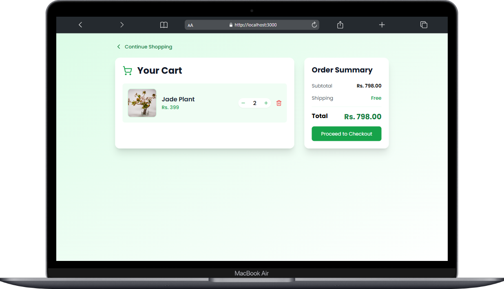
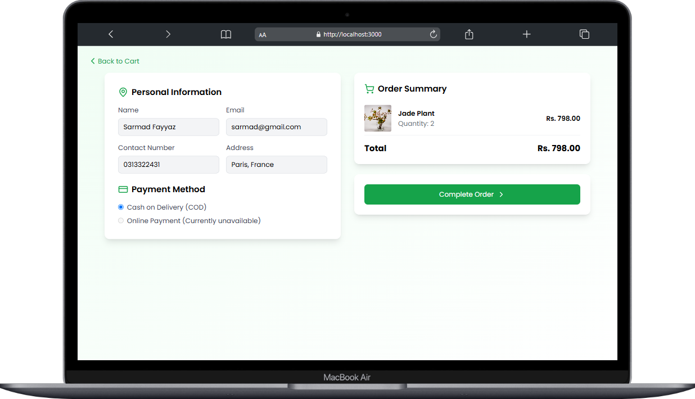
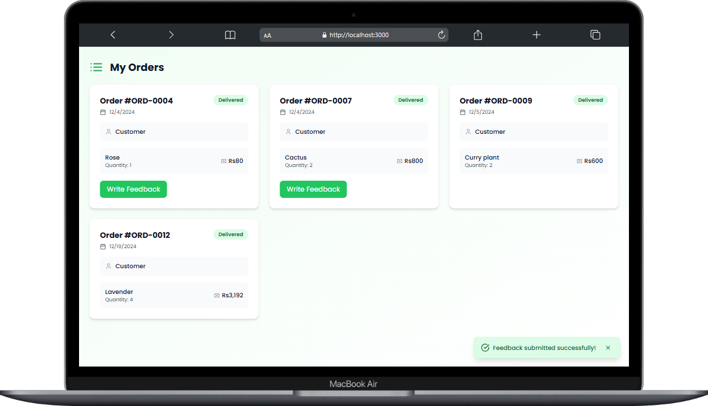
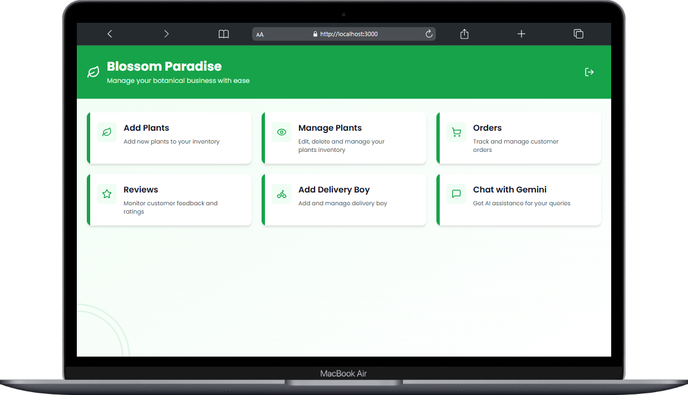
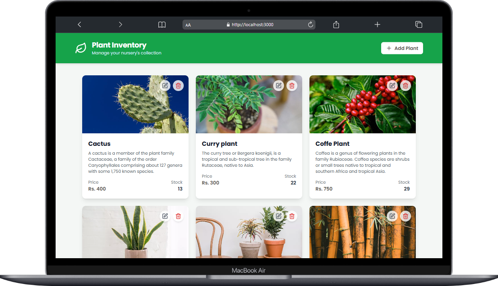
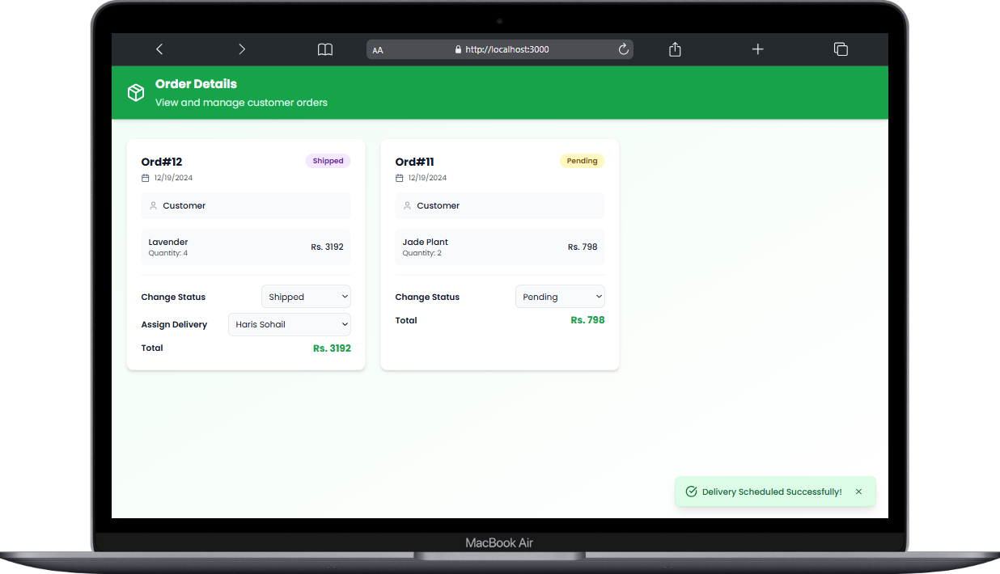
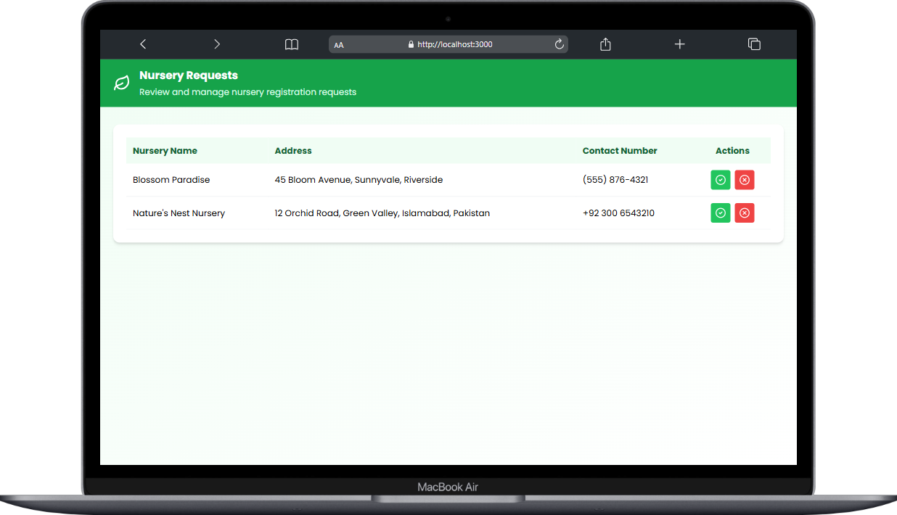

# 🌱 Nursery Zone Web

**Nursery Zone Web** is a React-based web application designed to streamline plant nursery operations. It provides an efficient platform for nurseries to manage their products, customers to place orders, and delivery personnel to track and deliver orders. The app features a role-based access system with a user-friendly interface, ensuring a seamless experience for all users.

## 🚀 Features

### Role-Based Access:

- **Super Admin**:

  - Approves or rejects nursery registration requests.
  - Manages analytics and overall platform monitoring.

- **Nursery Admin**:

  - Manages plant inventory (add, update, delete plants).
  - Tracks and updates the status of customer orders.
  - Registers their own delivery personnel.
  - Assigns delivery personnel for orders.

- **Customer**:

  - Browses plants from all nurseries and filters them.
  - Places orders for plants.
  - Tracks order status.
  - Provides reviews for purchased products.

- **Delivery Personnel**:
  - Views assigned orders.
  - Updates the order status to "Delivered" upon successful delivery.

### Additional Features:

- **Nursery Registration Workflow**:
  - Nurseries can sign up, and their requests are reviewed and approved/rejected by the Super Admin.
- **Customer Order Management**:
  - End-to-end tracking of orders, from placement to delivery.
- **Customer Reviews**:
  - Customers leave reviews after receiving the order.
  - Reviews are visible to other customers and Nursery Admins.
- **Chatbot Integration**:
  - Customers can get instant information about plants via an integrated chatbot.
  - The chatbot uses the **Gemini API** in the backend for seamless and intelligent conversations.
- **Stripe Payment Integration**:
  - Secure online payments for plant orders using Stripe.
  - Supports multiple payment methods.
  - Customers receive instant payment confirmations.

## 🛠️ Tech Stack

### Frontend:

- **React**:
  - Framework for building the web app.
  - User-friendly design with a seamless experience.

### Backend:

- **FastAPI**:
  - Lightweight and fast backend framework.
  - Handles user authentication, order management, and analytics.
- **Gemini API**:
  - Powers the chatbot for intelligent plant-related conversations.

## 📱 Application Workflow

1. **Nursery Registration**:

   - Nursery Admins sign up via the web app.
   - Super Admin reviews and approves/rejects the signup request.

2. **Plant Management**:

   - Approved Nursery Admins log in to add and manage their plants.

3. **Customer Orders**:

   - Customers browse plants, add them to their cart, and place orders.
   - Nursery Admins update the order status (e.g., processing, shipped).

4. **Delivery Management**:

   - Nursery Admin assigns orders to delivery personnel.
   - Delivery personnel update the order status to "Delivered" or "Cancelled".

5. **Chatbot Assistance**:

   - Customers can ask the chatbot questions about plants (e.g., care tips, delivery details).
   - The chatbot leverages the Gemini API to provide real-time answers.

6. **Customer Reviews**:
   - Customers leave reviews after receiving the order.
   - Reviews are visible to other customers and the Nursery Admin.

## 🔧 Installation

### Prerequisites:

- Node.js installed on your machine.
- Python environment for FastAPI backend.

## Screenshots











### Frontend Setup:

1. Clone the repository:

   ```bash
   git clone https://github.com/usamafayaz/nurseryzone-web.git

   ```

2. Navigate to the project directory:

   ```bash
   cd nurseryzone-web
   ```

3. Install React Native packages and dependencies:
   ```bash
   npm install
   ```
4. Setup your Gemini API_KEY

5. Start the React Native frontend:
   ```bash
   npm start
   ```

## Contact

For any inquiries, please contact [usama.fayyaz157@gmail.com].
